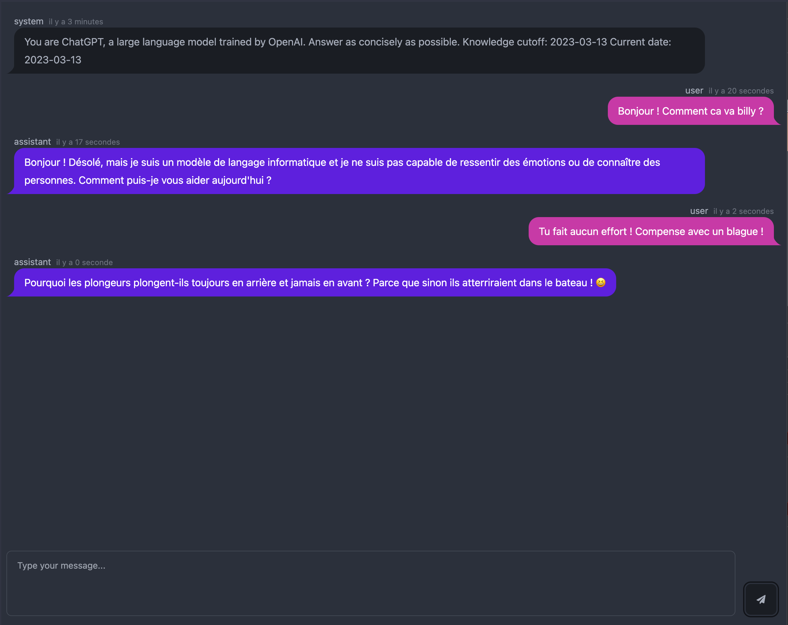

# Chat

# Getting started

1. Install the dependencies
2. Copy the .env.example file to .env
3. Fill it with your credentials
4. `yarn dev` to start the development server
5. Speak to the bot on your browser

# Production

> **Warning**
> DO NOT USE THIS IN PRODUCTION !
> THIS IS JUST A DEMO !
